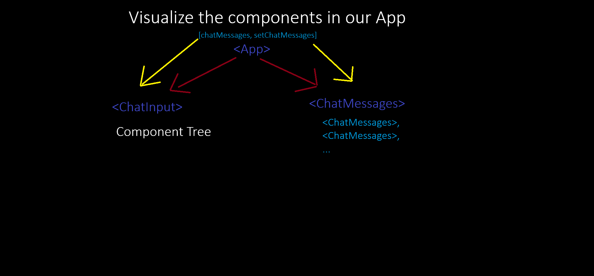

🧠 Lesson 1: React Basics & JSX
❓ What is React?

React is an external JavaScript library that helps us build websites more easily.

External library = code written by someone else, hosted outside our computer, that we can load and use in our project.

🔗 Why does React use two libraries?

React

Shared logic for websites and mobile apps

ReactDOM

Features specific to websites (DOM rendering)

⚙️ Setting up React

ReactDOM.createRoot() → sets up React

.render() → displays content on the page

🔄 What is Babel?

Babel is a JavaScript compiler that translates JSX into normal JavaScript.

✨ JSX (JavaScript XML)

JSX is an enhanced version of JavaScript

Allows writing HTML directly inside JavaScript

Example:

JSX

const button = <button>Click</button>;

Vanilla JavaScript

const button = document.createElement('button');
button.innerHTML = 'Click';

⚠️ Browsers do not understand JSX → Babel converts it into JavaScript.

🧩 Lesson 2: Components & Props
🧱 What is a Component?

A component is a piece of the website.

✅ Best practice: split a website into small reusable pieces.

⚠️ Rules for Components

Component names must start with a capital letter

Use PascalCase → ChatInput

JSX requires closing tags

<input />

🛠 Component Syntax
function Button(props) {
  return (
    

      <button>Click</button>
    

  );
}

Usage:

  <Button />

🧺 React Fragment

Group elements without adding extra 
:

<>
  <h1>Title</h1>
  
Description

</>

🎁 Props (Properties)

Props are arguments passed into components

They make components reusable

Destructuring Props
const { prop1, prop2 } = props;

Shortcut:

function Component({ prop1, prop2 }) {
  ...
}

🔀 Conditional Rendering (Guard Operator)

JSX does not allow if/else directly.

Use && instead:

{sender === "robot" && }

✅ Best Practice

Use a root component called App

🔄 Lesson 3: State, Events & Chatbot Features
🧠 How .map() Works
array.map((item) => {
  return newValue;
});

Each item returns a new value → creates a new array.

🧩 Keys in React
key={id}

Helps React track changes in arrays

📌 Example:

🖱 Event Handlers

Run functions when users interact

Use camelCase

onClick={handleClick}

event.target → element being interacted with

📦 State in React

State = data connected to the UI
When state updates → React updates the HTML automatically

⚠️ Never update state directly

❌ Wrong:

messages.push(newMessage);

✅ Correct:

setMessages([...messages, newMessage]);

📌 Example:

🧬 Spread Operator
const newArray = [...oldArray];

Creates a copy

Makes React more efficient

🧩 Array Destructuring (Order Matters)

🔼 Lifting State Up

Share state between multiple components

📛 Naming Convention (React Docs)
function Video({ video }) {
  return (
    

      ...
    

  );
}

<Video key={video.id} video={video} />

⚠️ Important Notes

Do not manipulate the DOM manually

Use React to manage inputs and UI

State updates are asynchronous

✅ React updates the UI after all code finishes running

🚀 Summary

React simplifies UI development

JSX makes code readable

Components make apps modular

State keeps UI in sync

React handles DOM updates automatically
