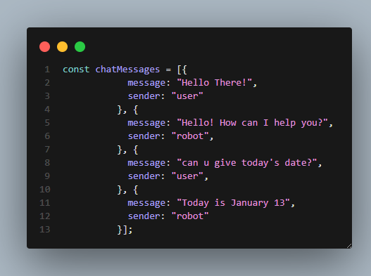
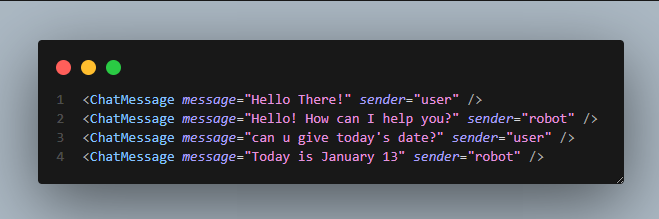
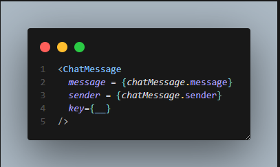
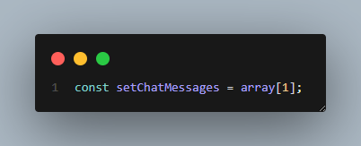
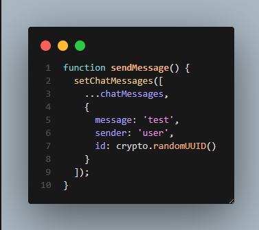

Lesson 1: React basics, JSX
what is react? 
React = external library that helps us to create websites easier.
1- External library = code that is outside our computer = code that someone else wrote.
 - it's a bunch of code that is outside our computer.
 - We can load this code on our website, and use it.
 - Why are there 2 external libraries for React?

React can be used in different places.
	1- React = shared features for websites and mobile apps.
	2 - ReactDOM = features specific for websites.
2- React helps us to create websites easier.
  ReactDOM.create() = sets up React
  .render = display something
  - What is Babel?
Babel = JavaScript compiler = translates another languages into JavaScript.
- 
When using React, we don't use normal JavaScript = wer use JSX instead of normal JavaScript.
We use an enhanced version of JavaScript = JSX = JavaScript XML = same as JavaScript, but we can write HTML directly in our JavaScript code.
Example:
	in JSX:
		const button = <button>Click</button>
	in JavaScript;
		const button = document.createElement('button');
		button.innerHTML = 'Click';
Problem:
- Our Web Browser does not understand JSX.
- We need to translate JSX into JavaScript.

Lesson 2: Components, Props
Components = a piece of of the website
When building websites:
- It's better to split up the website into pieces.
- So we can work on a small piece of the website at a time.
WARNING: The component name must start with a capital letter.
PascalCase = each word starts with a capital letter: (ChatInput)
JSX is more strict than normal HTML. So all elements need a closing tag.
<tagname /> = shortcut for: <tagname></tagname>  = self-closing element
COMPONENT SYNTAX:
function Button(props){
	retunr (
	  

	      <button>Click</button>
	  

	)
}
const div = (
	

	   <Button />
    

);
React lets us split our website into smaller pieces(components).(This lets us work on a small piece of the website at a time)
Fragment = <></> : group elements together, without creating an extra 

props = properties : are arguments passed into components : Make our components reusable.
Shortcuts in React (Destructuring):
const {prop1,prop2..} = props; => const prop1 = props.prop1; 
function Component({props}) {const {prop1,prop2} = props} ... => function ({prop1,prop2..}) {...}
in JSX we cant use if-else statement in curly brakets we use instead the Guard Operator (&&):
const result = value1 && value2;
- if value1 is true, the result will be value2.
- this works just like an if-statement.
EXAMPLE:
Instead of this (delete the single quotes):
if (sender === "robot") {
    return (
        

            ''
            {message}
        

    );
}
We use this (delete the single quotes):
{sender === "robot" $$ ''}

Best Practice:
- Use a component (App) to create a Website.

Lesson 3: State, Event Handlers, Create the Chatbot Features
How .map() works:
(chatMessage) => {
    return ...     --------> new value1 
}
(chatMessage) => {
    return ...     --------> new value2 
}
(chatMessage) => {
    return ...     --------> new value3
}
(chatMessage) => {
    return ...     --------> new value4
}

{} = save the value/result of the code into the prop (including a function)
** 1- Save the data **
** 2- Generate the HTML **

key = helps React track changes in the array
Event Handler = run a function when interact with the website
camelCase = first word is lowercase, all other words start with a capital
cyrpto.randomUUID() : generate a unique ID string
** State ** = data that is connected to the HTML. When we update this data, it will update the HTML
🛑 In React, we should not update the data directly. If we update the data directly React will not update the HTML

If we use this function to update the data, React will update the HTML (Updater Function)
In React, we should not modify the data directly. We should always create a copy, and then modify the copy
(This helps React be more efficient)
Spread Operator (...) = takes the values in an arrya, and then copies them into a new array
Example:

** Array Destructuring (The order matters) : **

React Best Practice:
Do not use the DOM manually (React is managing the website)
We should use React features to get the text from a textbox
onClick = run a function that we click
event.target = gives us the element that we're typing in
** State ** = save data that changes over time
Lifting the State Up : share state between multiple components

Naming convention used in the React Documentation
Example:
    function Video({video}) {
        retrun (
            

            ...
        )
    }
    <Video key={video.id} video={video}>
value = change the text inside this <input>
To get response from the Chatbot we should add en external library:
** Please Note ** : State does not update immediately ❌ State is updated after all the code is finished ✅
Update the state ➡️ React automatically update the website